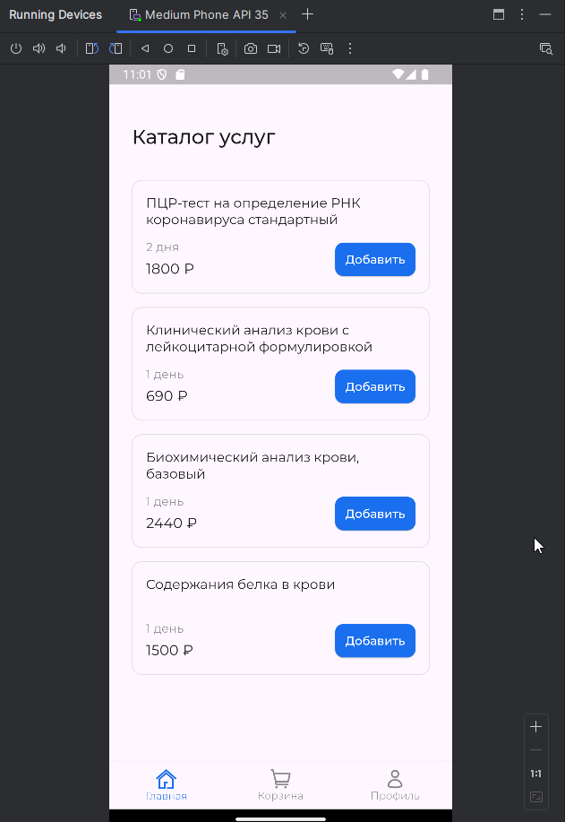
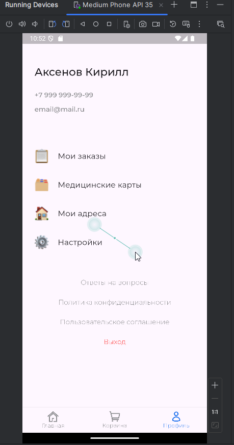
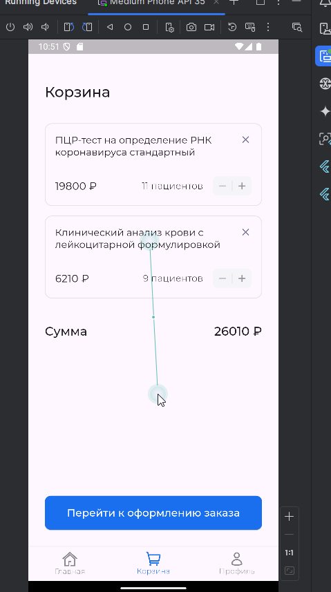

# Практическая работа №7

## Аксенов К.В ЭФБО-01-22

### Ход работы:
Я разработал модели для профиля пользователя, а также для услуг и товаров, добавленных в корзину. Кроме того, создал компоненты для страниц: Корзина, Главная и Профиль. Среди них — карточка услуги в корзине, карточка услуги на главной странице и счетчик для корзины.

Для правильного согласования существительных с числительными я использовал пакет intl и вынес функции склонения слов в отдельный файл *utils.dart*. Для подключения изображений добавил *assets: assets/images*, а для работы со шрифтами — пакет *google_fonts*. Для обработки SVG-файлов использовал *flutter_svg*
### Результат

